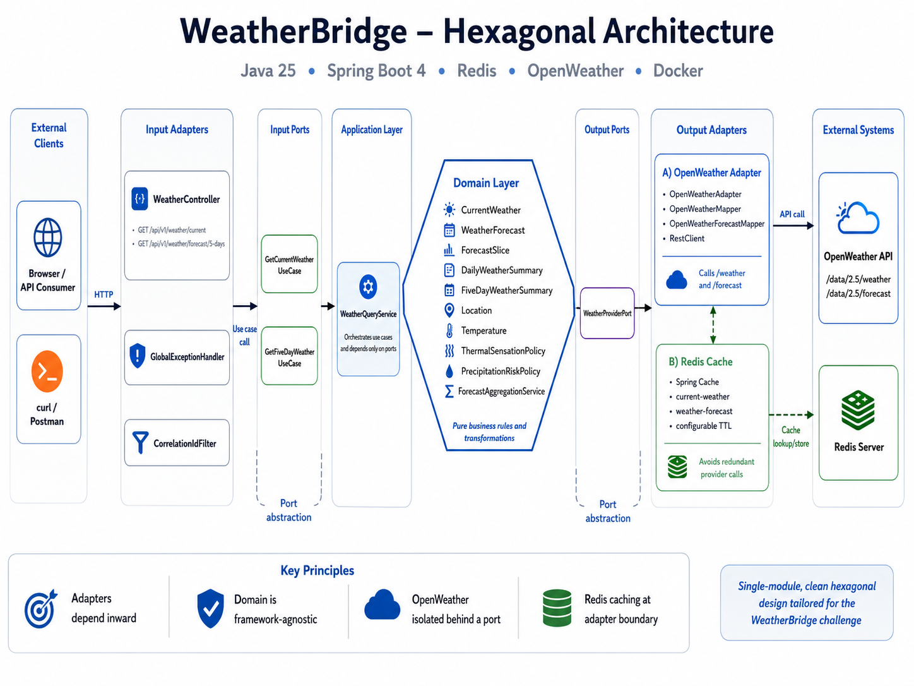

# WeatherBridge Backend

WeatherBridge is a lightweight internal weather integration service built with Java 25 and Spring Boot.

The application consumes the OpenWeather API, normalizes provider-specific responses, applies domain transformations, caches results in Redis, and exposes stable REST contracts for downstream services.

## Technology Stack

* Java 25
* Spring Boot 4.0.5
* Maven 3.9+
* Spring MVC
* Spring `RestClient`
* Spring Cache
* Redis
* Spring Boot Actuator
* Docker
* Docker Compose
* JUnit 5
* Mockito
* MockMvc

## Main Features

* Current weather lookup by city
* Five-day weather summary
* OpenWeather integration
* Metric unit normalization
* Wind-speed conversion from meters per second to kilometers per hour
* Thermal sensation classification
* Precipitation-risk classification
* Three-hour forecast aggregation into daily summaries
* Timezone-aware forecast grouping
* Redis-backed caching
* Configurable cache TTL
* Standardized API errors using `ProblemDetail`
* Provider authentication-error handling
* Provider timeout handling
* Provider rate-limit handling
* Request correlation ID
* Application health endpoint
* Docker multi-stage build
* Docker Compose local environment

## REST Endpoints

### Current Weather

```http
GET /api/v1/weather/current
```

Query parameters:

| Parameter     | Required | Description                               |
| ------------- | -------: | ----------------------------------------- |
| `city`        |      Yes | City name                                 |
| `stateCode`   |       No | Two-letter state code                     |
| `countryCode` |       No | Two-letter country code; defaults to `BR` |

Example:

```bash
curl --get \
  "http://localhost:8080/api/v1/weather/current" \
  --data-urlencode "city=Macapa" \
  --data-urlencode "stateCode=AP" \
  --data-urlencode "countryCode=BR"
```

Example response:

```json
{
  "location": {
    "city": "Macapá",
    "stateCode": "AP",
    "countryCode": "BR",
    "latitude": 0.0349,
    "longitude": -51.0694,
    "timezoneOffsetSeconds": -10800
  },
  "observedAt": "2026-06-15T19:30:00Z",
  "temperature": {
    "value": 31.4,
    "feelsLike": 36.2,
    "difference": 4.8,
    "unit": "CELSIUS",
    "category": "VERY_HOT"
  },
  "humidityPercent": 72,
  "atmosphericPressureHpa": 1009,
  "windSpeedKmh": 13.7,
  "cloudinessPercent": 40,
  "condition": "Clouds",
  "description": "scattered clouds",
  "source": "OPEN_WEATHER"
}
```

### Five-Day Weather Summary

```http
GET /api/v1/weather/forecast/5-days
```

Example:

```bash
curl --get \
  "http://localhost:8080/api/v1/weather/forecast/5-days" \
  --data-urlencode "city=Macapa" \
  --data-urlencode "stateCode=AP" \
  --data-urlencode "countryCode=BR"
```

Example response:

```json
{
  "location": {
    "city": "Macapá",
    "stateCode": "AP",
    "countryCode": "BR",
    "latitude": 0.0349,
    "longitude": -51.0694,
    "timezoneOffsetSeconds": -10800
  },
  "generatedAt": "2026-06-15T19:35:00Z",
  "days": [
    {
      "date": "2026-06-15",
      "minimumTemperatureCelsius": 24.1,
      "maximumTemperatureCelsius": 32.7,
      "averageTemperatureCelsius": 28.3,
      "averageFeelsLikeCelsius": 33.5,
      "averageHumidityPercent": 76,
      "maximumPrecipitationProbabilityPercent": 78.0,
      "precipitationRisk": "HIGH",
      "totalPrecipitationMillimeters": 8.4,
      "maximumWindSpeedKmh": 21.6,
      "dominantCondition": "Rain"
    }
  ],
  "source": "OPEN_WEATHER"
}
```

## Architecture

WeatherBridge uses a lightweight Hexagonal Architecture, also known as Ports and Adapters Architecture.

The main goal is to isolate application and domain rules from external technologies such as HTTP, OpenWeather, Redis, and Spring MVC.

### Architecture Diagram

Place the customized architecture image at:

```text
docs/architecture/weatherbridge-hexagonal-architecture.png
```

Then include it in this section:

```markdown

```


### Architectural Overview

```text
                           External Clients
                                  |
                                  v
                    +---------------------------+
                    |       Input Adapter       |
                    |                           |
                    |     WeatherController     |
                    | GlobalExceptionHandler    |
                    |  CorrelationIdFilter      |
                    +-------------+-------------+
                                  |
                            Input Ports
                                  |
                                  v
                    +---------------------------+
                    |     Application Layer     |
                    |                           |
                    | WeatherQueryService       |
                    | GetCurrentWeatherUseCase  |
                    | GetFiveDayWeatherUseCase  |
                    +-------------+-------------+
                                  |
                                  v
                    +---------------------------+
                    |       Domain Layer        |
                    |                           |
                    | CurrentWeather            |
                    | WeatherForecast           |
                    | DailyWeatherSummary       |
                    | ThermalSensationPolicy    |
                    | PrecipitationRiskPolicy   |
                    | ForecastAggregationService|
                    +-------------+-------------+
                                  |
                           Output Ports
                                  |
                                  v
              +-------------------+-------------------+
              |                                       |
              v                                       v
    +-----------------------+              +-----------------------+
    | OpenWeather Adapter   |              |     Redis Cache       |
    |                       |              |                       |
    | OpenWeatherAdapter    |              | Spring Cache          |
    | OpenWeatherMapper     |              | RedisCacheManager     |
    | ForecastMapper        |              | Configurable TTL      |
    +-----------+-----------+              +-----------------------+
                |
                v
      +---------------------+
      |   OpenWeather API   |
      |                     |
      | /data/2.5/weather   |
      | /data/2.5/forecast  |
      +---------------------+
```

### Domain Layer

The domain layer contains business concepts and deterministic transformation rules.

Main components:

* `CurrentWeather`
* `WeatherForecast`
* `ForecastSlice`
* `DailyWeatherSummary`
* `FiveDayWeatherSummary`
* `Temperature`
* `Location`
* `ThermalSensation`
* `PrecipitationRisk`
* `ThermalSensationPolicy`
* `PrecipitationRiskPolicy`
* `ForecastAggregationService`

This layer does not depend directly on:

* Spring MVC
* HTTP
* Redis
* OpenWeather DTOs
* Docker
* Controller response classes

### Application Layer

The application layer coordinates use cases and depends on abstractions.

Input ports:

* `GetCurrentWeatherUseCase`
* `GetFiveDayWeatherUseCase`

Output ports:

* `WeatherProviderPort`

Application service:

* `WeatherQueryService`

The application service does not know how OpenWeather is called. It only depends on `WeatherProviderPort`.

### Input Adapters

Input adapters expose the application to external consumers.

Main components:

* `WeatherController`
* `CurrentWeatherResponse`
* `FiveDayWeatherResponse`
* `GlobalExceptionHandler`
* `CorrelationIdFilter`

Responsibilities:

* receive HTTP requests;
* normalize query parameters;
* call input ports;
* map domain objects to API contracts;
* return HTTP responses;
* convert exceptions into standardized errors;
* propagate correlation IDs.

### Output Adapters

Output adapters implement communication with external systems.

Main components:

* `OpenWeatherAdapter`
* `OpenWeatherMapper`
* `OpenWeatherForecastMapper`
* `OpenWeatherCurrentResponse`
* `OpenWeatherForecastResponse`

Responsibilities:

* call OpenWeather endpoints;
* add the API key and query parameters;
* translate provider status codes;
* map external DTOs to domain models;
* normalize units;
* protect the application from provider-specific contracts.

### Dependency Direction

Dependencies point inward:

```text
Adapters → Application → Domain
```

The domain does not depend on adapters.

The application does not depend on OpenWeather implementation details.

The OpenWeather adapter implements a port defined by the application layer.

### Why Hexagonal Architecture?

The architecture was selected because it provides:

* clear separation of concerns;
* external-provider isolation;
* stable internal contracts;
* testable domain rules;
* replaceable infrastructure;
* easier failure simulation;
* reduced coupling with OpenWeather;
* easier migration to another weather provider;
* easier substitution of Redis by another cache technology.

### Architecture Tradeoff

For this challenge, the architecture remains inside a single Maven module.

This avoids unnecessary complexity such as:

* multiple Maven modules;
* generic frameworks;
* event brokers;
* database persistence;
* excessive interfaces;
* distributed workflow orchestration.

The objective is to obtain architectural boundaries without overengineering.

## Data Transformation

### Temperature

OpenWeather data is requested in metric units.

The API returns:

* current temperature in Celsius;
* feels-like temperature in Celsius;
* minimum temperature in Celsius;
* maximum temperature in Celsius.

### Wind Speed

OpenWeather returns wind speed in meters per second.

WeatherBridge converts it to kilometers per hour:

```text
windSpeedKmh = windSpeedMetersPerSecond × 3.6
```

### Thermal Sensation

The feels-like temperature is classified as:

| Feels-like temperature | Category    |
| ---------------------: | ----------- |
|              Below 5°C | `VERY_COLD` |
|          5°C to 14.9°C | `COLD`      |
|         15°C to 22.9°C | `MILD`      |
|         23°C to 27.9°C | `WARM`      |
|         28°C to 32.9°C | `HOT`       |
|          33°C or above | `VERY_HOT`  |

These thresholds are application-defined business classifications.

### Precipitation Risk

The daily precipitation risk uses the highest precipitation probability found in that day.

| Probability | Risk        |
| ----------: | ----------- |
|   0% to 29% | `LOW`       |
|  30% to 59% | `MODERATE`  |
|  60% to 79% | `HIGH`      |
| 80% to 100% | `VERY_HIGH` |

The maximum probability is used instead of the average because an average could hide a short period with a high rain probability.

### Daily Forecast Aggregation

The OpenWeather five-day endpoint returns forecast entries in three-hour intervals.

WeatherBridge groups entries by the local date of the requested city.

For each date, the application calculates:

* minimum temperature;
* maximum temperature;
* average temperature;
* average feels-like temperature;
* average humidity;
* maximum precipitation probability;
* total precipitation volume;
* maximum wind speed;
* dominant weather condition;
* precipitation-risk category.

The city timezone offset is applied before grouping timestamps into dates.

## Caching Strategy

Redis is used to prevent redundant OpenWeather calls.

Cache names:

```text
current-weather
weather-forecast
temperature-alert
```

Default TTL values:

| Cache             |        TTL |
| ----------------- | ---------: |
| Current weather   | 10 minutes |
| Five-day forecast | 30 minutes |
| Temperature alert | 30 minutes |

Example normalized cache key:

```text
macapa:ap:br
```

The cache is applied at the OpenWeather adapter boundary.

This means:

* use cases remain independent of Spring Cache;
* provider calls are cached;
* normalized domain results are reused;
* external DTOs do not leak into the cache contract.

## Error Handling

The API uses `ProblemDetail` and centralized exception handling.

Examples:

| Situation                   | HTTP status | Internal code                           |
| --------------------------- | ----------: | --------------------------------------- |
| Invalid query parameter     |       `400` | `INVALID_REQUEST`                       |
| City not found              |       `404` | `CITY_NOT_FOUND`                        |
| Invalid OpenWeather API key |       `502` | `WEATHER_PROVIDER_AUTHENTICATION_ERROR` |
| OpenWeather rate limit      |       `503` | `WEATHER_PROVIDER_RATE_LIMITED`         |
| OpenWeather timeout         |       `504` | `WEATHER_PROVIDER_TIMEOUT`              |
| OpenWeather unavailable     |       `502` | `WEATHER_PROVIDER_UNAVAILABLE`          |
| Invalid provider payload    |       `502` | `INVALID_PROVIDER_RESPONSE`             |
| Unexpected error            |       `500` | `INTERNAL_ERROR`                        |

Example:

```json
{
  "detail": "OpenWeather rejected the configured API key.",
  "instance": "/api/v1/weather/current",
  "status": 502,
  "title": "Weather provider authentication error",
  "type": "urn:weatherbridge:error:weather_provider_authentication_error",
  "code": "WEATHER_PROVIDER_AUTHENTICATION_ERROR",
  "timestamp": "2026-06-15T19:08:24.629973555Z",
  "correlationId": "f5303214-fd32-4879-9b92-b5e081d6163b"
}
```

## Observability

The application provides:

* correlation IDs;
* structured contextual logs;
* operation duration;
* request parameters;
* provider failure classification;
* forecast aggregation logs;
* thermal classification logs;
* precipitation-risk classification logs;
* Actuator health endpoint;
* Redis health indicator;
* metrics endpoint.

Actuator endpoints:

```text
/actuator/health
/actuator/info
/actuator/metrics
```

The OpenWeather API key must never be written to logs.

## Requirements

For local execution:

* JDK 25
* Maven 3.9+
* Docker
* Docker Compose
* OpenWeather API key

The Docker build does not require Maven to be installed on the host because Maven runs in the Docker build stage.

## Configure Environment

Create the local environment file:

```bash
cp .env.example .env
```

Edit `.env.local`:

```dotenv
OPENWEATHER_API_KEY=your-real-api-key

REDIS_HOST=redis
REDIS_PORT=6379

CURRENT_WEATHER_CACHE_TTL=10m
FORECAST_CACHE_TTL=30m
```

Do not commit `.env.local`.

Recommended `.gitignore` entries:

```gitignore
.env
.env.local
.env.*
!.env.example
```

## Build Locally

```bash
mvn clean install
```

Expected artifact:

```text
target/weatherbridge-backend-0.0.1-SNAPSHOT.jar
```

## Run Redis and the API with Docker

Stop existing containers:

```bash
docker compose \
  --env-file .env.local \
  down --remove-orphans
```

Build without cache:

```bash
docker compose \
  --env-file .env.local \
  build --no-cache
```

Start the services:

```bash
docker compose \
  --env-file .env.local \
  up
```

Run in detached mode:

```bash
docker compose \
  --env-file .env.local \
  up --build -d
```

View API logs:

```bash
docker compose \
  --env-file .env.local \
  logs -f api
```

## Verify Services

List services:

```bash
docker compose \
  --env-file .env.local \
  ps
```

Test Redis:

```bash
docker compose exec redis redis-cli ping
```

Expected:

```text
PONG
```

Test Actuator:

```bash
curl http://localhost:8080/actuator/health
```

Expected:

```json
{
  "status": "UP"
}
```

## Test the Endpoints

Current weather:

```bash
curl --silent --get \
  "http://localhost:8080/api/v1/weather/current" \
  --data-urlencode "city=Macapa" \
  --data-urlencode "stateCode=AP" \
  --data-urlencode "countryCode=BR" | jq
```

Five-day summary:

```bash
curl --silent --get \
  "http://localhost:8080/api/v1/weather/forecast/5-days" \
  --data-urlencode "city=Macapa" \
  --data-urlencode "stateCode=AP" \
  --data-urlencode "countryCode=BR" | jq
```

## Demonstrate Cache Behavior

Clear Redis:

```bash
docker compose exec redis redis-cli FLUSHALL
```

Make the first request:

```bash
curl --silent --get \
  "http://localhost:8080/api/v1/weather/current" \
  --data-urlencode "city=Macapa" \
  --data-urlencode "stateCode=AP" \
  --data-urlencode "countryCode=BR" > /dev/null
```

Inspect keys:

```bash
docker compose exec redis redis-cli --scan
```

Repeat the same request:

```bash
curl --silent --get \
  "http://localhost:8080/api/v1/weather/current" \
  --data-urlencode "city=Macapa" \
  --data-urlencode "stateCode=AP" \
  --data-urlencode "countryCode=BR" > /dev/null
```

The OpenWeather adapter log should appear only for the first request while the cached entry is valid.

## Technical Presentation Guide

Suggested presentation duration: 10–15 minutes.

### 1. Business Scenario and Requirements

Explain:

* why downstream services should not consume OpenWeather directly;
* the need for stable internal contracts;
* the two REST endpoints;
* the need for transformation, caching, and error handling;
* the optional webhook requirement;
* the importance of rate-limit protection.

Technical points:

* external API coupling;
* provider-contract instability;
* anti-corruption layer;
* latency reduction;
* quota protection;
* normalized data contracts.

### 2. Technology Decisions

Present:

* Java 25;
* Spring Boot 4;
* Spring MVC;
* Spring `RestClient`;
* Redis;
* Docker;
* Docker Compose;
* Actuator.

Explain why Spring MVC was chosen instead of WebFlux:

* synchronous integration;
* low expected concurrency for the challenge;
* simpler execution model;
* lower cognitive overhead;
* easier debugging and demonstration.

Explain why `RestClient` was selected:

* fluent synchronous API;
* integration with Spring Boot;
* status-code handling;
* request factory customization;
* configurable connection and read timeouts.

### 3. Hexagonal Architecture

Show the customized architecture diagram.

Explain the dependency flow:

```text
HTTP Adapter
    ↓
Input Port
    ↓
Application Service
    ↓
Output Port
    ↓
OpenWeather Adapter
```

Technical topics:

* ports and adapters;
* dependency inversion;
* domain isolation;
* provider independence;
* testability;
* anti-corruption boundary;
* single-module architecture;
* avoidance of overengineering.

Demonstrate that:

* `WeatherQueryService` does not know OpenWeather;
* `WeatherProviderPort` belongs to the application layer;
* `OpenWeatherAdapter` implements the port;
* provider DTOs remain inside the output adapter;
* controllers only depend on input ports.

### 4. Current Weather Flow

Walk through:

1. `WeatherController`;
2. `WeatherLocationQuery`;
3. `GetCurrentWeatherUseCase`;
4. `WeatherQueryService`;
5. `WeatherProviderPort`;
6. `OpenWeatherAdapter`;
7. `OpenWeatherMapper`;
8. domain response;
9. `CurrentWeatherResponse`.

Technical topics:

* query normalization;
* country defaulting;
* cache-key normalization;
* API-key injection;
* HTTP timeout;
* provider-response validation;
* wind conversion;
* thermal-sensation classification;
* domain-to-HTTP mapping.

### 5. Five-Day Summary Flow

Explain that OpenWeather does not directly return one object per day.

It returns multiple entries with three-hour intervals.

Walk through:

1. request to `/forecast`;
2. mapping to `ForecastSlice`;
3. conversion of Unix timestamps;
4. application of city timezone offset;
5. grouping by local date;
6. daily aggregation;
7. five-day limiting;
8. API response mapping.

Technical calculations:

* minimum temperature;
* maximum temperature;
* arithmetic averages;
* precipitation-volume sum;
* maximum precipitation probability;
* maximum wind speed;
* condition frequency;
* deterministic tie behavior;
* precipitation-risk classification.

### 6. Transformation Policies

Present `ThermalSensationPolicy`.

Explain:

* why the rule belongs in the domain;
* deterministic behavior;
* boundary values;
* independent unit testing;
* no dependency on Spring.

Present `PrecipitationRiskPolicy`.

Explain:

* percentage validation;
* application-defined thresholds;
* why maximum probability is used;
* distinction between provider data and derived business information.

### 7. Redis Cache

Explain where caching is applied:

```text
WeatherQueryService
    ↓
WeatherProviderPort
    ↓
Cached OpenWeatherAdapter
```

Technical topics:

* `@Cacheable`;
* `sync = true`;
* normalized keys;
* TTL;
* shared cache;
* multiple application instances;
* cache miss;
* cache hit;
* provider quota reduction;
* cache serialization.

Live demonstration:

1. clear Redis;
2. make the first request;
3. show OpenWeather adapter log;
4. inspect Redis keys;
5. repeat request;
6. show absence of a second provider call;
7. display TTL.

### 8. Error Handling

Demonstrate:

* missing `city`;
* invalid country code;
* nonexistent city;
* invalid API key;
* provider rate limit;
* provider timeout.

Explain the translation:

```text
OpenWeather 401
    ↓
WeatherProviderException.AUTHENTICATION
    ↓
GlobalExceptionHandler
    ↓
502 Bad Gateway
```

Technical topics:

* `ProblemDetail`;
* internal error codes;
* external error isolation;
* correlation ID;
* no raw provider-body exposure;
* no API-key logging;
* distinction between client and upstream failures.

### 9. Observability

Show:

* request correlation ID;
* controller logs;
* application-service logs;
* adapter logs;
* domain-policy logs;
* aggregation duration;
* provider failures;
* `/actuator/health`;
* Redis health status.

Explain why logs exist at multiple boundaries:

* controller: request context;
* application service: use-case execution;
* adapter: external integration;
* domain service: transformation details;
* exception handler: HTTP error translation.

Also explain log-level strategy:

* `INFO`: business operation lifecycle;
* `DEBUG`: technical processing details;
* `TRACE`: individual forecast slices and classification boundaries;
* `WARN`: expected recoverable failures;
* `ERROR`: unexpected or processing failures.

### 10. Docker and Runtime

Explain the multi-stage Dockerfile:

```text
Maven + JDK build image
        ↓
Compiled executable JAR
        ↓
Java 25 runtime image
```

Technical points:

* dependency caching;
* smaller final image;
* source code excluded from runtime image;
* non-root user;
* environment-based configuration;
* Redis health check;
* Compose dependency ordering.

### 11. Testing Strategy

Present the recommended tests:

Unit tests:

* `ThermalSensationPolicyTest`
* `PrecipitationRiskPolicyTest`
* `ForecastAggregationServiceTest`
* `WeatherQueryServiceTest`

Web tests:

* `WeatherControllerTest`
* `GlobalExceptionHandlerTest`

Adapter tests:

* successful OpenWeather mapping;
* city not found;
* invalid API key;
* provider timeout;
* rate limit;
* malformed provider payload.

Important aggregation scenarios:

* timezone crossing midnight;
* missing rain field;
* missing snow field;
* dominant-condition tie;
* partial first forecast day;
* exactly five returned days;
* precipitation at threshold boundaries.

### 12. Tradeoffs

Acknowledge the main tradeoffs:

* Redis adds infrastructure but supports shared cache;
* MVC uses one thread during the external request;
* no automatic retry avoids rate-limit amplification;
* no database because permanent persistence is unnecessary;
* one Maven module reduces project complexity;
* thresholds are application-defined, not meteorological standards;
* provider availability still affects cache misses;
* webhook failures should not break the main weather response.

### 13. Possible Improvements

Mention:

* OpenAPI and Swagger UI;
* Testcontainers;
* WireMock;
* ArchUnit;
* Redis JSON serialization configuration;
* cache-key versioning;
* stale-cache fallback;
* circuit breaker;
* selective retries;
* Prometheus metrics;
* OpenTelemetry tracing;
* webhook signing;
* asynchronous webhook delivery;
* multiple weather providers;
* API authentication;
* request rate limiting;
* CI/CD pipeline;
* container-security scanning.

## Important Notes

* The Dockerfile uses the official Maven image during the build stage.
* The project does not require `.mvn`, `mvnw`, or `mvnw.cmd`.
* The final image runs with Java 25 and a numeric non-root user.
* Docker Compose requires `OPENWEATHER_API_KEY`.
* `.env.local` must be supplied with `--env-file`.
* Current weather and five-day summary endpoints are implemented.
* The domain layer contains thermal-sensation and precipitation-risk policies.
* The five-day result is derived from three-hour forecast entries.
* Redis protects the provider from redundant requests.
* Sensitive values must not appear in logs.
* Detailed `TRACE` logging should be enabled only during investigation.
