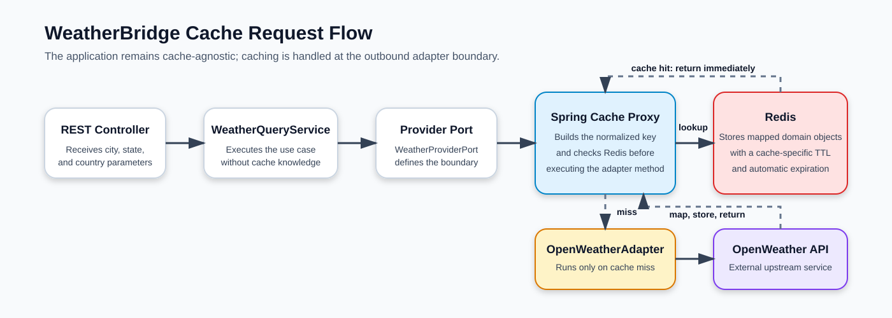
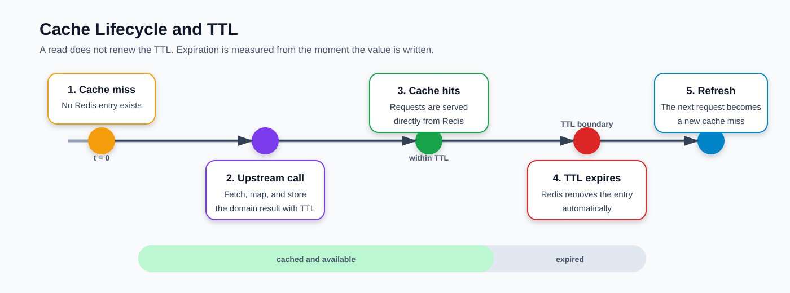

# WeatherBridge — Caching and Error Handling

This document provides a presentation-friendly overview of how **caching** and **error handling** behave in WeatherBridge.

## Overview

WeatherBridge uses **Spring Cache** and **Redis** to reduce repeated OpenWeather calls, improve response time, and protect the provider quota.

```text
Client
  ↓
WeatherController
  ↓
WeatherQueryService
  ↓
WeatherProviderPort
  ↓
Redis Cache
  ├─ Hit  → return cached domain object
  └─ Miss → call OpenWeather API
```



Caching is applied at the `OpenWeatherAdapter` boundary, keeping Redis outside the application and domain layers.

## Cache Implementation

```java
@Cacheable(
        cacheNames = "current-weather",
        key = "#root.args[0].cacheKey()",
        sync = true
)
public CurrentWeather getCurrentWeather(
        WeatherLocationQuery query
) {
    // OpenWeather call and mapping
}
```

The same approach is used for the five-day forecast.

`sync = true` prevents multiple simultaneous requests for the same key from triggering duplicate OpenWeather calls during a cache miss.

## Cache Keys

The location is normalized before the key is generated.

```text
City:    " Macapá "
State:   "AP"
Country: "BR"

Cache key:
macapa:ap:br
```

Example Redis key:

```text
weather-bridge::current-weather::macapa:ap:br
```

Separate cache names prevent collisions:

```text
current-weather
weather-forecast
temperature-alert
```

## Cache TTL

| Cache | Purpose | Default TTL |
|---|---|---:|
| `current-weather` | Current weather result | 10 minutes |
| `weather-forecast` | Five-day forecast result | 30 minutes |
| `temperature-alert` | Webhook deduplication | 30 minutes |

Configuration:

```dotenv
CURRENT_WEATHER_CACHE_TTL=10m
FORECAST_CACHE_TTL=30m
WEATHER_ALERT_CACHE_TTL=30m
```



## How Caching Behaves

### First request: cache miss

```text
Redis has no valid entry
  → OpenWeather is called
  → provider response is mapped to a domain object
  → result is stored in Redis
  → response is returned
```

### Repeated request: cache hit

```text
Redis contains a valid entry
  → cached domain object is returned
  → OpenWeatherAdapter method is not executed
  → no external request is made
```

### After the TTL expires

```text
Redis removes the expired entry
  → next request becomes a cache miss
  → fresh data is loaded and cached again
```

Reading a cached value does not restart its TTL.

## How Error Handling Behaves

WeatherBridge converts provider failures into stable internal error contracts using `ProblemDetail` and `GlobalExceptionHandler`.

| Situation | HTTP status | Internal code |
|---|---:|---|
| Invalid query parameter | `400` | `INVALID_REQUEST` |
| City not found | `404` | `CITY_NOT_FOUND` |
| Invalid OpenWeather API key | `502` | `WEATHER_PROVIDER_AUTHENTICATION_ERROR` |
| OpenWeather rate limit | `503` | `WEATHER_PROVIDER_RATE_LIMITED` |
| OpenWeather timeout | `504` | `WEATHER_PROVIDER_TIMEOUT` |
| Provider unavailable or connection failure | `502` | `WEATHER_PROVIDER_UNAVAILABLE` |
| Invalid provider payload | `502` | `INVALID_PROVIDER_RESPONSE` |
| Unexpected application or cache failure | `500` | `INTERNAL_ERROR` |

### Main behavior

```text
Valid cache entry
  → return cached data
  → provider is not called

Cache miss + provider success
  → cache result
  → return response

Cache miss + provider failure
  → map exception
  → return standardized error
  → do not cache the failure
```

Only successful method return values are cached. Exceptions and null values are not stored.

A failed OpenWeather call does not overwrite an existing successful cached value.

## Error Response Example

```json
{
  "status": 503,
  "title": "Weather provider rate limited",
  "code": "WEATHER_PROVIDER_RATE_LIMITED",
  "detail": "OpenWeather rate limit was reached.",
  "instance": "/api/v1/weather/current",
  "correlationId": "f5303214-fd32-4879-9b92-b5e081d6163b"
}
```

The correlation ID is also propagated through logs, making each failed request easier to trace.

## Temperature Alert Deduplication

The `temperature-alert` cache prevents repeated webhook delivery for the same location and threshold during the configured TTL.

```text
Temperature exceeds threshold
  ↓
Deduplication key exists?
  ├─ Yes → skip duplicate webhook
  └─ No  → send webhook and cache the key
```

Example:

```text
weather-bridge::temperature-alert::macapa:ap:br:35
```

## Presentation Demo

### 1. First request

```bash
curl --silent --get \
  "http://localhost:8080/api/v1/weather/current" \
  --data-urlencode "city=Macapa" \
  --data-urlencode "stateCode=AP" \
  --data-urlencode "countryCode=BR"
```

Expected behavior:

```text
Cache miss → OpenWeather call → value stored in Redis
```

### 2. Inspect Redis

```bash
docker compose exec redis redis-cli --scan
```

Expected key:

```text
weather-bridge::current-weather::macapa:ap:br
```

Check the TTL:

```bash
docker compose exec redis redis-cli TTL \
  "weather-bridge::current-weather::macapa:ap:br"
```

### 3. Repeat the request

Expected behavior:

```text
Cache hit → response from Redis → no OpenWeather call
```

### 4. Demonstrate error handling

Invalid input:

```bash
curl --silent \
  "http://localhost:8080/api/v1/weather/current?countryCode=BRA"
```

Expected result:

```text
400 INVALID_REQUEST
```

Unknown city:

```bash
curl --silent --get \
  "http://localhost:8080/api/v1/weather/current" \
  --data-urlencode "city=CityThatDoesNotExist123456" \
  --data-urlencode "countryCode=BR"
```

Expected result:

```text
404 CITY_NOT_FOUND
```

## Summary

```text
Cache miss → OpenWeather → Redis → response
Cache hit  → Redis → response
Expired    → reload fresh data
Failure    → standardized error → nothing cached
```

The design improves performance and resilience while preserving the boundaries of WeatherBridge's Hexagonal Architecture.
