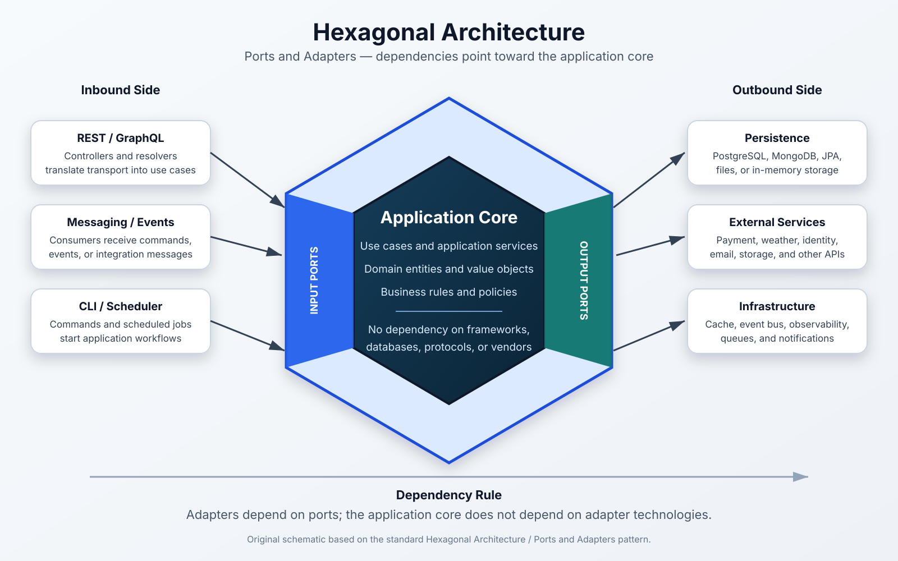

# Hexagonal Architecture Overview



Hexagonal Architecture, also known as **Ports and Adapters Architecture**, structures an application so that its business logic remains independent of frameworks, databases, user interfaces, messaging systems, and external services.

The core principle is:

> The application core defines what it offers and what it needs. External technologies adapt themselves to those boundaries.

This architecture was introduced by Alistair Cockburn to reduce the coupling between business logic and infrastructure. The word *hexagonal* is primarily a visual metaphor: an application may have many entry and exit points, not necessarily six.

---

## 1. High-Level Structure

```text
                 Inbound Adapters
        REST, GraphQL, CLI, Events, Jobs
                         |
                         v
                    Input Ports
                     Use Cases
                         |
                         v
          +---------------------------+
          |     Application Core      |
          |                           |
          |  Application Services     |
          |  Domain Models            |
          |  Business Rules           |
          +---------------------------+
                         |
                         v
                    Output Ports
                         |
                         v
                 Outbound Adapters
       Database, APIs, Cache, Queue, Email
```

The architecture separates the system into three broad areas:

1. **Application core** — domain rules and use-case orchestration.
2. **Ports** — explicit boundaries represented by interfaces or contracts.
3. **Adapters** — technology-specific implementations that communicate through those ports.

---

## 2. The Application Core

The application core contains the code that expresses the purpose of the system. It should remain independent of delivery mechanisms and infrastructure technologies.

It commonly includes:

- domain entities;
- value objects;
- domain services;
- business policies;
- use-case interfaces;
- application services;
- domain and application exceptions.

The core should not know whether it is being invoked through HTTP, a command-line interface, a message broker, or a scheduled job. It should also not know whether data is stored in PostgreSQL, MongoDB, a file, or an external service.

---

## 3. Domain Layer

The domain layer contains the essential business concepts and rules.

```java
public final class Order {

    private final UUID id;
    private OrderStatus status;

    public Order(UUID id, OrderStatus status) {
        this.id = Objects.requireNonNull(id);
        this.status = Objects.requireNonNull(status);
    }

    public void confirm() {
        if (status != OrderStatus.PENDING) {
            throw new IllegalStateException(
                    "Only pending orders can be confirmed."
            );
        }

        status = OrderStatus.CONFIRMED;
    }

    public UUID getId() {
        return id;
    }

    public OrderStatus getStatus() {
        return status;
    }
}
```

The domain model should not depend on:

- Spring;
- JPA or Hibernate;
- REST or GraphQL;
- PostgreSQL or MongoDB;
- Kafka, RabbitMQ, or Redis;
- external API clients;
- framework-specific annotations.

A rich domain model protects its own invariants. Instead of exposing unrestricted setters, it offers meaningful operations such as `confirm`, `cancel`, `approve`, or `changeAddress`.

---

## 4. Application Layer

The application layer coordinates use cases. It defines the operations that the system exposes and orchestrates domain objects and output ports.

### Input port

```java
public interface ConfirmOrderUseCase {

    void confirm(UUID orderId);
}
```

### Application service

```java
public final class ConfirmOrderService
        implements ConfirmOrderUseCase {

    private final OrderRepositoryPort repository;

    public ConfirmOrderService(
            OrderRepositoryPort repository
    ) {
        this.repository = repository;
    }

    @Override
    public void confirm(UUID orderId) {
        Order order = repository.findById(orderId)
                .orElseThrow(() ->
                        new OrderNotFoundException(orderId)
                );

        order.confirm();

        repository.save(order);
    }
}
```

Application services usually handle:

- use-case orchestration;
- transaction boundaries;
- loading and saving aggregates;
- authorization decisions related to the use case;
- communication with output ports;
- coordination between domain objects.

They should avoid containing infrastructure code or transport-specific concerns.

---

## 5. Ports

Ports are explicit contracts that define how the application communicates with the outside world.

They are normally represented by interfaces, although a port can also be modeled as a protocol, function type, command object, or message contract.

### 5.1 Input Ports

Input ports define the operations offered by the application.

Examples:

```text
CreateOrderUseCase
ConfirmOrderUseCase
CancelOrderUseCase
FindOrderUseCase
GenerateInvoiceUseCase
```

They answer the question:

> What can an external actor ask the application to do?

An input port should express business intent rather than transport details.

Prefer:

```java
confirmOrderUseCase.confirm(orderId);
```

Avoid making the application layer depend on concepts such as `HttpServletRequest`, HTTP status codes, JSON payloads, or framework controllers.

### 5.2 Output Ports

Output ports define capabilities that the application requires from external systems.

Examples:

```text
OrderRepositoryPort
PaymentGatewayPort
NotificationPort
EventPublisherPort
CachePort
DocumentStoragePort
```

They answer the question:

> What does the application need from the outside world to complete a use case?

Example:

```java
public interface OrderRepositoryPort {

    Optional<Order> findById(UUID id);

    Order save(Order order);
}
```

The application owns this interface. An external adapter implements it.

---

## 6. Adapters

Adapters translate between a technology-specific representation and an application port.

There are two main categories.

### 6.1 Inbound Adapters

Inbound adapters initiate use cases through input ports.

Common examples:

- REST controllers;
- GraphQL resolvers;
- command-line handlers;
- message consumers;
- scheduled jobs;
- WebSocket handlers;
- desktop or mobile user interfaces.

```java
@RestController
@RequestMapping("/orders")
public final class OrderController {

    private final ConfirmOrderUseCase confirmOrderUseCase;

    public OrderController(
            ConfirmOrderUseCase confirmOrderUseCase
    ) {
        this.confirmOrderUseCase = confirmOrderUseCase;
    }

    @PostMapping("/{id}/confirm")
    public ResponseEntity<Void> confirm(
            @PathVariable UUID id
    ) {
        confirmOrderUseCase.confirm(id);
        return ResponseEntity.noContent().build();
    }
}
```

The controller is responsible for HTTP concerns, such as:

- parsing path variables and request bodies;
- validating transport-level input;
- mapping requests into commands;
- invoking an input port;
- mapping results and exceptions into HTTP responses.

It should not contain the business rule that determines whether an order may be confirmed.

### 6.2 Outbound Adapters

Outbound adapters implement output ports by using concrete technologies.

Common examples:

- JPA persistence adapters;
- MongoDB repositories;
- external HTTP clients;
- Redis cache adapters;
- Kafka publishers;
- email providers;
- cloud storage adapters;
- observability integrations.

```java
@Component
public final class OrderPersistenceAdapter
        implements OrderRepositoryPort {

    private final SpringDataOrderRepository repository;
    private final OrderPersistenceMapper mapper;

    public OrderPersistenceAdapter(
            SpringDataOrderRepository repository,
            OrderPersistenceMapper mapper
    ) {
        this.repository = repository;
        this.mapper = mapper;
    }

    @Override
    public Optional<Order> findById(UUID id) {
        return repository.findById(id)
                .map(mapper::toDomain);
    }

    @Override
    public Order save(Order order) {
        OrderEntity entity = mapper.toEntity(order);
        OrderEntity saved = repository.save(entity);
        return mapper.toDomain(saved);
    }
}
```

This adapter may depend on Spring Data, JPA, SQL, and database-specific behavior because those concerns remain outside the application core.

---

## 7. Dependency Rule

Dependencies must point toward the application core.

```text
Adapters ---> Ports ---> Application and Domain
```

The core owns its contracts. Infrastructure depends on those contracts, not the opposite.

### Incorrect direction

```text
Domain ------> JPA
Domain ------> Spring
Application --> PostgreSQLRepository
Application --> ExternalApiClient
```

### Preferred direction

```text
REST Adapter ---------> Input Port
JPA Adapter ----------> Repository Port
HTTP Client Adapter --> External Service Port
Application Service --> Domain Model
```

Dependency inversion makes it possible to replace an adapter without rewriting the use case.

For example:

```text
PostgreSQL Adapter
        |
        v
OrderRepositoryPort
        ^
        |
In-Memory Adapter
```

Both adapters satisfy the same contract.

---

## 8. Typical Java Project Structure

```text
src/main/java/com/example/order
├── domain
│   ├── model
│   │   ├── Order.java
│   │   └── OrderStatus.java
│   ├── exception
│   │   └── InvalidOrderStateException.java
│   └── service
│       └── OrderPolicy.java
│
├── application
│   ├── port
│   │   ├── in
│   │   │   ├── ConfirmOrderUseCase.java
│   │   │   ├── CreateOrderUseCase.java
│   │   │   └── FindOrderUseCase.java
│   │   └── out
│   │       ├── OrderRepositoryPort.java
│   │       ├── PaymentGatewayPort.java
│   │       └── EventPublisherPort.java
│   ├── command
│   │   └── CreateOrderCommand.java
│   └── service
│       ├── ConfirmOrderService.java
│       └── CreateOrderService.java
│
├── adapter
│   ├── in
│   │   ├── web
│   │   │   ├── OrderController.java
│   │   │   ├── OrderRequest.java
│   │   │   └── OrderWebMapper.java
│   │   └── messaging
│   │       └── OrderMessageConsumer.java
│   └── out
│       ├── persistence
│       │   ├── OrderEntity.java
│       │   ├── OrderPersistenceAdapter.java
│       │   ├── OrderPersistenceMapper.java
│       │   └── SpringDataOrderRepository.java
│       ├── payment
│       │   └── PaymentGatewayAdapter.java
│       └── messaging
│           └── KafkaEventPublisherAdapter.java
│
└── configuration
    └── OrderConfiguration.java
```

Package names may vary. The important rule is that the project structure makes architectural boundaries visible and prevents the core from depending on adapters.

---

## 9. Request Flow Example

A request to confirm an order may follow this path:

```text
HTTP Request
    |
    v
OrderController                    Inbound adapter
    |
    v
ConfirmOrderUseCase                Input port
    |
    v
ConfirmOrderService                Application service
    |
    v
Order                              Domain model
    |
    v
OrderRepositoryPort                Output port
    |
    v
OrderPersistenceAdapter            Outbound adapter
    |
    v
PostgreSQL                         External technology
```

The response returns through the reverse path.

The same use case could later be invoked by a Kafka consumer or scheduled job without changing the domain model or application service.

---

## 10. Mapping Between Layers

Hexagonal systems frequently use separate models for different boundaries:

- HTTP request and response DTOs;
- application commands and results;
- domain entities and value objects;
- persistence entities;
- external API payloads.

Example flow:

```text
OrderRequest
    |
    v
CreateOrderCommand
    |
    v
Order
    |
    v
OrderEntity
```

Mappers add code, but they prevent framework and vendor-specific models from leaking into the core.

A mapper should translate data, not implement business rules.

---

## 11. Testing Strategy

Hexagonal Architecture supports tests at different levels.

### Domain unit test

```java
@Test
void shouldConfirmPendingOrder() {
    Order order = new Order(
            UUID.randomUUID(),
            OrderStatus.PENDING
    );

    order.confirm();

    assertEquals(
            OrderStatus.CONFIRMED,
            order.getStatus()
    );
}
```

### Application test with a fake adapter

```java
@Test
void shouldLoadConfirmAndSaveOrder() {
    InMemoryOrderRepository repository =
            new InMemoryOrderRepository();

    Order order = new Order(
            UUID.randomUUID(),
            OrderStatus.PENDING
    );

    repository.save(order);

    ConfirmOrderUseCase useCase =
            new ConfirmOrderService(repository);

    useCase.confirm(order.getId());

    assertEquals(
            OrderStatus.CONFIRMED,
            repository.findById(order.getId())
                    .orElseThrow()
                    .getStatus()
    );
}
```

### Adapter integration test

An adapter integration test verifies that a concrete adapter satisfies its port contract, for example by testing a JPA adapter against a real PostgreSQL test container.

This separation allows most business tests to run quickly without starting the entire framework.

---

## 12. Main Benefits

### Technology independence

The core is protected from direct dependencies on databases, web frameworks, message brokers, and vendors.

### Testability

Use cases can be tested using in-memory or fake implementations of output ports.

### Replaceable adapters

A PostgreSQL adapter can be replaced by MongoDB, or an email provider can be replaced by another provider, without changing the core contract.

### Multiple entry points

The same use case can be exposed through REST, GraphQL, messaging, CLI, or scheduled execution.

### Explicit boundaries

Ports reveal which capabilities the application offers and which external capabilities it requires.

### Maintainability

Infrastructure changes are less likely to affect business rules, while business rules remain easier to locate and understand.

---

## 13. Tradeoffs

Hexagonal Architecture is not free of cost.

Typical tradeoffs include:

- more interfaces and classes;
- additional mappers;
- more explicit configuration;
- a steeper learning curve;
- possible overengineering in small CRUD systems;
- architectural boundaries that require discipline to preserve.

The architecture is especially valuable when:

- business rules are important;
- the system integrates with several external services;
- external technologies may change;
- multiple delivery mechanisms exist;
- automated testing is a priority;
- the application is expected to evolve over several years.

For a small and short-lived CRUD application, a simpler layered structure may be sufficient.

---

## 14. Practical Guidelines

1. Create ports around meaningful system boundaries, not around every class.
2. Name ports according to business capabilities or required external capabilities.
3. Keep framework annotations out of the domain whenever practical.
4. Keep HTTP, database, and messaging models outside the core.
5. Put business rules in domain objects or domain services.
6. Use application services for orchestration, not infrastructure logic.
7. Let outbound adapters implement interfaces owned by the application.
8. Test the core with fake or in-memory adapters.
9. Avoid generic abstractions that hide business meaning.
10. Treat dependency direction as more important than folder naming.

---

## 15. Common Mistakes

### Creating an interface for every service

Hexagonal Architecture does not require one interface per class. Ports should represent real boundaries.

### Treating the domain as an anemic data model

Entities containing only fields and setters push business rules into application services and weaken the domain model.

### Returning persistence entities from controllers

This exposes database concerns to the transport layer and couples public APIs to persistence decisions.

### Putting business rules in controllers

Controllers are adapters. They should translate requests and responses, not decide core business behavior.

### Making ports depend on framework types

A port that receives `HttpServletRequest`, `ResponseEntity`, or a JPA entity is not fully isolated from its adapter technology.

### Hiding all behavior behind generic repositories

Generic repositories may be useful, but business-oriented methods such as `findPendingOrdersForCustomer` can communicate intent more clearly.

---

## 16. Hexagonal Architecture and Related Styles

Hexagonal Architecture shares important ideas with:

- **Clean Architecture**;
- **Onion Architecture**;
- **Domain-Driven Design**;
- **Dependency Inversion Principle**;
- **Layered Architecture**.

They all encourage dependencies to point toward stable business rules. Their terminology and diagram shapes differ, but their central concern is similar: prevent volatile infrastructure from controlling the application core.

---

## 17. Summary

Hexagonal Architecture organizes software around business capabilities rather than frameworks.

```text
External actors
      |
      v
Inbound adapters
      |
      v
Input ports
      |
      v
Application and domain core
      |
      v
Output ports
      |
      v
Outbound adapters
      |
      v
External systems
```

Its central rules are:

- the application core owns its ports;
- adapters depend on those ports;
- dependencies point inward;
- business rules remain independent of delivery and infrastructure technologies;
- technology-specific details stay at the edges of the system.

The goal is not to maximize abstraction. The goal is to keep business logic stable, testable, understandable, and protected from external change.
